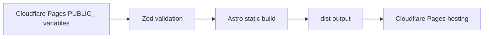

# Architecture

## Overview

This platform builds a static placeholder page that can be reused across multiple domains. Domain-specific rendering is controlled through Cloudflare Pages build-time `PUBLIC_` environment variables.

## Architecture Summary

| Area            | Decision                                                                                  |
| --------------- | ----------------------------------------------------------------------------------------- |
| Rendering       | Static site generation through Astro.                                                     |
| Configuration   | Build-time `PUBLIC_` variables validated with Zod.                                        |
| Hosting target  | Cloudflare Pages static output from `dist/`.                                              |
| SEO baseline    | Dynamic canonical URL, robots metadata, and sitemap generation.                           |
| Privacy posture | Minimize unnecessary exposure of operational metadata in source code and rendered output. |
| Localization    | Lightweight locale-ready copy structure before adding a full i18n framework.              |

## Why Astro

Astro is a strong fit for this repository because the platform needs fast, static, low-maintenance placeholder pages rather than a hydrated application shell.

- Static-first rendering keeps the output simple, inspectable, and easy to host on Cloudflare Pages.
- Minimal client-side JavaScript reduces runtime complexity, security surface, and performance risk.
- Strong SEO characteristics support canonical metadata, sitemap generation, and robots behavior at build time.
- Low-cost Cloudflare Pages hosting works well with static output and globally cached assets.
- Component-based authoring keeps the placeholder implementation maintainable without over-abstracting.
- Fast global delivery aligns with the goal of reusable lightweight pages for multiple domains.

## Key Decisions

- Astro static output keeps hosting simple and inexpensive.
- Zod validates public configuration at build/startup time so missing Cloudflare Pages variables fail early.
- The `astro.config.mjs` `site` value is read from `PUBLIC_SITE_URL` for correct canonical URLs and sitemap output.
- Placeholder copy is locale-ready without introducing a full i18n framework before it is needed.
- Domain ownership metadata is not represented in source code.
- The source should minimize unnecessary exposure of operational metadata, including private ownership, account, deployment, or contact details.

## Configuration Flow

1. Cloudflare Pages injects `PUBLIC_` variables at build time.
2. `astro.config.mjs` validates `PUBLIC_SITE_URL` for site-level generation.
3. `src/config/public.ts` validates all rendering configuration.
4. Astro generates static HTML, metadata, `robots.txt`, and sitemap output.

Deployment readiness is covered in [Deployment](deployment.md). CI/CD and review expectations are covered in [Governance](governance.md).

## Future IaC Readiness

TODO(terraform): Represent each Cloudflare Pages project as data-driven infrastructure with per-domain environment variables, DNS bindings, and deployment policies.

TODO(terraform): Add non-secret examples for environment variable maps while keeping sensitive Cloudflare API tokens in GitHub or Cloudflare secret stores.
