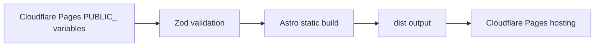
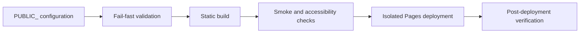

# Architecture

## Overview

This platform builds a static placeholder page that can be reused across multiple domains. Domain-specific rendering is controlled through Cloudflare Pages build-time `PUBLIC_` environment variables.

## Architecture Summary

| Area            | Decision                                                                                  |
| --------------- | ----------------------------------------------------------------------------------------- |
| Rendering       | Static site generation through Astro.                                                     |
| Configuration   | Build-time `PUBLIC_` variables validated with Zod.                                        |
| Hosting target  | Cloudflare Pages static output from `dist/`.                                              |
| SEO baseline    | Dynamic canonical URL, robots metadata, and sitemap generation.                           |
| Privacy posture | Minimize unnecessary exposure of operational metadata in source code and rendered output. |
| Localization    | Typed English, Simplified Chinese, and Thai content contract before route-based i18n.     |
| Observability   | Public-safe static `/platform.json` metadata with a Zod-validated contract.               |

## Platform Characteristics

| Characteristic                   | Implementation Posture                                                                                   |
| -------------------------------- | -------------------------------------------------------------------------------------------------------- |
| Configuration-driven rendering   | Public rendering values come from validated `PUBLIC_` variables.                                         |
| Deployment-specific environments | Each Cloudflare Pages project owns its own project variables.                                            |
| Isolated deployments             | Each pilot domain should use a separate Pages project.                                                   |
| Reusable topology                | One repository can support multiple domains without hardcoding production values.                        |
| Validation-first workflow        | Formatting, linting, env validation, build, smoke, and accessibility checks run through `pnpm validate`. |
| Focused test foundation          | Vitest covers source TypeScript config, localization, UTF-8 integrity, and robots helpers.               |
| Security-first governance        | CodeQL, Gitleaks, no-secret guidance, and protected-file care are documented.                            |
| Future IaC compatibility         | Naming and safety principles are documented before Terraform scaffolding is introduced.                  |

## Why Astro

Astro is a strong fit for this repository because the platform needs fast, static, low-maintenance placeholder pages rather than a hydrated application shell.

- Static-first rendering keeps the output simple, inspectable, and easy to host on Cloudflare Pages.
- Minimal client-side JavaScript reduces runtime complexity, security surface, and performance risk.
- Strong SEO characteristics support canonical metadata, sitemap generation, and robots behavior at build time.
- Low-cost Cloudflare Pages hosting works well with static output and globally cached assets.
- Component-based authoring keeps the placeholder implementation maintainable without over-abstracting.
- Fast global delivery aligns with the goal of reusable lightweight pages for multiple domains.

## Key Decisions

- Astro static output keeps hosting simple and inexpensive.
- Zod validates public configuration at build/startup time so missing Cloudflare Pages variables fail early.
- The `astro.config.mjs` `site` value is read from `PUBLIC_SITE_URL` for correct canonical URLs and sitemap output.
- Placeholder copy uses a typed `en`, `zh-CN`, and `th` content contract without introducing a full i18n framework before it is needed.
- `/platform.json` exposes safe static platform metadata for lightweight operational visibility.
- Domain ownership metadata is not represented in source code.
- The source should minimize unnecessary exposure of operational metadata, including private ownership, account, deployment, or contact details.

Durable decision rationale is recorded in [Architecture Decision Records](adr/README.md). The initial ADRs cover static-first rendering, Cloudflare Pages Git integration, validation-before-automation, non-authoritative Terraform, environment-driven multi-domain rendering, and localization without route-based i18n.

## Configuration Flow

1. Cloudflare Pages injects `PUBLIC_` variables at build time.
2. `astro.config.mjs` validates `PUBLIC_SITE_URL` for site-level generation.
3. `src/config/public.ts` validates all rendering configuration.
4. Astro generates static HTML, metadata, `robots.txt`, and sitemap output.

## Localization Foundation

Phase 6 keeps localization shallow and static:

- Supported locales are `en`, `zh-CN`, and `th`.
- `PUBLIC_PRIMARY_LOCALE` selects the root `<html lang>` value and primary localized copy.
- `PUBLIC_SECONDARY_LOCALE` selects a secondary localized message.
- Locale-specific message blocks carry their own `lang` attributes.
- Missing locale variables use the documented defaults: `en` and `zh-CN`.
- Unsupported locale values fail validation during build.
- Focused Vitest tests cover locale defaults, unsupported values, Thai support, content shape, and duplicate secondary suppression.
- Smoke validation checks localized content, Simplified Chinese and Thai UTF-8 output, root language metadata, locale-specific `lang` attributes, canonical URLs, robots behavior, and sitemap output.
- Route-based i18n, locale-prefixed URLs, per-locale sitemap entries, and external i18n frameworks are deferred.

Phase 6E adds Thai through the existing `th` locale tag and shared multilingual layout. It does not add language switching, browser language detection, or route-based i18n.

Coverage is visible through Vitest reports but remains non-gating by percentage. Phase 6F focuses coverage on source TypeScript runtime decisions while leaving Astro rendering, generated output, scripts, docs, and Terraform validation to the existing build, smoke, pa11y, markdownlint, and Terraform checks.

Deployment readiness is covered in [Deployment](deployment.md). CI/CD and review expectations are covered in [Governance](governance.md). ADR governance is documented in [Architecture Decision Records](adr/README.md).

## Operational Lifecycle

This lifecycle keeps validation before provisioning, domain deployments isolated, and rollback or forward-fix decisions easier to reason about.

## Future IaC Readiness

Terraform/IaC planning is documented in [Terraform and IaC Planning](iac.md). The current repository is ready for a future non-destructive validation skeleton, but it does not include provider configuration, backend configuration, imports, applies, or provisioning automation.

TODO(terraform): Represent each Cloudflare Pages project as data-driven infrastructure with per-domain environment variables, DNS bindings, and deployment policies once import and state-management safety is reviewed.
