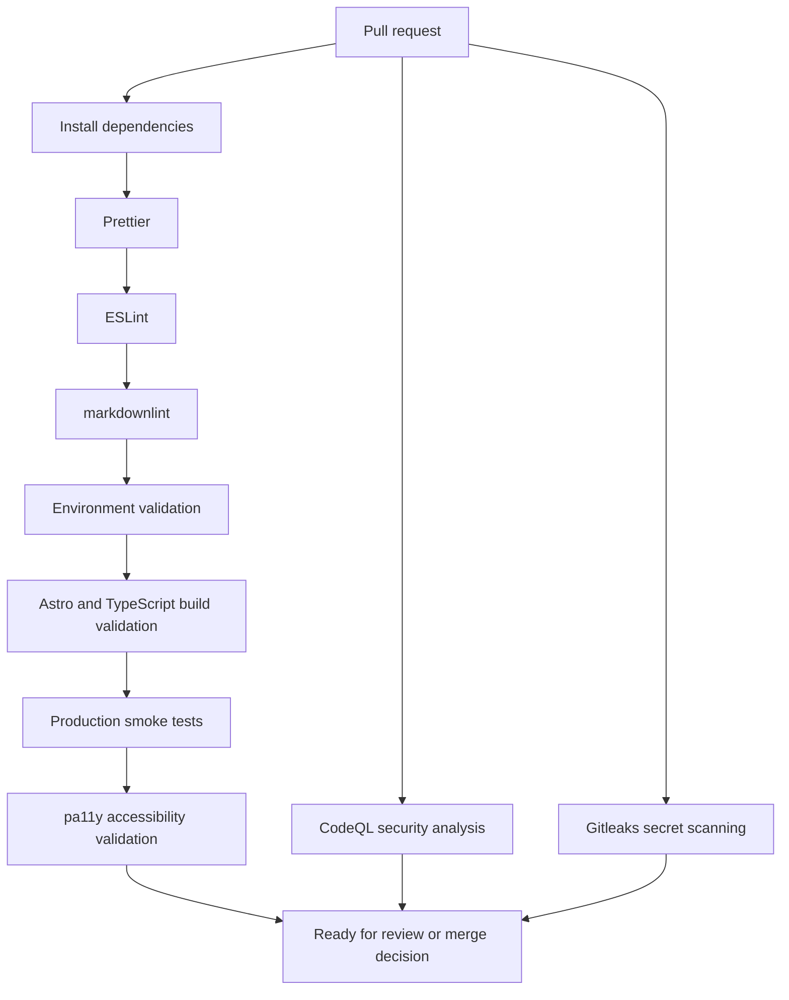

# Governance

This repository uses governance-first engineering: small reviewed changes, explicit validation, minimal operational metadata exposure, and documentation that stays close to implementation.

## Workflow

- Use trunk-based development with short-lived branches.
- Protect `main`.
- Require pull requests for all merges.
- Require passing validation checks before merge.
- Use conventional commits.
- Prefer documentation-first changes for architecture, deployment, security, and operational practices.
- Keep Cloudflare deployment changes separate from documentation-only governance changes unless a small repo hygiene update is clearly necessary.
- Keep local `.env` usage separate from deployed configuration; Cloudflare Pages project variables are the source of truth for production and preview behavior.
- Keep Terraform/IaC work plan-first until [Terraform and IaC Planning](iac.md) progresses beyond documentation-only scope.

## Review Standards

Every PR should answer:

- What changed?
- How was it validated?
- Does it unnecessarily expose operational metadata such as private ownership, account, deployment, or contact details?
- Does it preserve environment-variable-driven rendering?
- Does it remain lightweight and maintainable?

## Operational Philosophy

Operational changes should favor fail-fast validation, domain-level deployment isolation, operational clarity over abstraction, and reversible steps. The platform should minimize unnecessary exposure of operational metadata while keeping deployment behavior easy to inspect and explain.

## CI/CD Pipeline

The repository's validation commands are part of the operational governance model. They make formatting, build behavior, environment validation, production-output smoke checks, and accessibility checks repeatable locally and in GitHub Actions.

The repository includes GitHub Actions workflows for validation and CodeQL analysis. Branch protection should require passing checks before merge when configured in GitHub, but branch protection settings are managed outside the repository.



## Current CI/CD Gates

These gates map to current repository scripts and workflows:

| Gate                                  | Command or Source                                              |
| ------------------------------------- | -------------------------------------------------------------- |
| Formatting validation                 | `pnpm format:check`                                            |
| ESLint validation                     | `pnpm lint`                                                    |
| markdownlint validation               | `pnpm check:markdown`                                          |
| Environment validation                | `pnpm check:env`, backed by `scripts/check-env-validation.ts`  |
| Astro and TypeScript build validation | `pnpm build`, invoked by `pnpm smoke`                          |
| Production smoke validation           | `pnpm smoke`, backed by `scripts/smoke-production.mjs`         |
| Accessibility validation              | `pnpm check:a11y`, backed by `scripts/check-accessibility.mjs` |
| Integrated local/CI validation        | `pnpm validate`                                                |
| CodeQL security analysis              | `.github/workflows/codeql.yml`                                 |
| Secret scanning                       | `.github/workflows/gitleaks.yml`                               |

CodeQL runs on pull requests, pushes to `main`, and a weekly schedule.
Gitleaks runs on pull requests and pushes to `main` to detect accidentally committed secrets.

Local contributors should use the same primary confidence command documented in the [README](../README.md#current-validation-commands):

```sh
pnpm validate
```

## Accessibility Philosophy

Accessibility is a first-class engineering concern for the platform. Placeholder pages are intentionally simple, but they still represent public-facing infrastructure and should be usable by default.

- Use semantic HTML and clear landmark structure from the beginning.
- Keep the layout responsive and mobile-first so content remains readable across viewport sizes.
- Run automated pa11y validation against built production output.
- Preserve heading order and visible text clarity as content evolves.
- Treat multilingual rendering as an accessibility concern, including correct `lang` attributes and copy that does not assume one language length or layout pattern.
- Pair automated checks with manual review before public launch because tooling cannot fully evaluate assistive technology behavior, translation quality, or contextual clarity.

## Definition of Done

A change is done when:

| Requirement                          | Expected Evidence                                                                           |
| ------------------------------------ | ------------------------------------------------------------------------------------------- |
| Local validation passes              | `pnpm validate` completes successfully.                                                     |
| CI checks pass                       | Required GitHub Actions checks are green before merge.                                      |
| Documentation is updated             | README or relevant `docs/` files reflect changed behavior or operations.                    |
| Deployment implications are reviewed | Any Cloudflare, DNS, indexing, or environment-variable effects are understood before merge. |
| Environment config is validated      | Zod validation and smoke checks cover required public configuration.                        |
| Accessibility checks pass            | pa11y runs successfully, with manual review planned for production-facing changes.          |

Deployment-specific readiness is tracked in [Deployment](deployment.md#production-deployment-checklist).

## Local Environment Loading

Fail-fast environment validation is intentional. `pnpm build` should fail when required `PUBLIC_` variables are missing from the process environment.

For local builds, contributors may use:

```sh
pnpm build:local
```

This loads `.env` through `dotenv-cli` before running the normal build. The script is a developer-experience wrapper only; it does not change the production build contract.

## Deployment Governance

Cloudflare deployment work should preserve the multi-project model documented in [Deployment](deployment.md):

- one shared repository
- one Cloudflare Pages project per pilot domain
- strict `placeholder-[domain-name]` project naming
- project-specific `PUBLIC_` variables
- no production domain values hardcoded into application source
- rollback or disablement scoped to the affected domain whenever possible

High-risk change areas require extra review:

- deployment workflows and GitHub Actions
- environment validation logic
- canonical URL handling
- robots and sitemap generation
- Cloudflare environment documentation
- secret scanning configuration
- future Terraform or infrastructure-as-code files

Terraform/IaC planning is documented in [Terraform and IaC Planning](iac.md). Until a future phase explicitly introduces a reviewed skeleton or workflow, this repository should not include Cloudflare provider credentials, Terraform backend configuration, or production apply automation.

Production change checklist:

- [ ] Correct Cloudflare Pages project selected.
- [ ] Correct custom domain mapped.
- [ ] Deployment-specific `PUBLIC_` variables reviewed.
- [ ] Smoke and accessibility validation pass.
- [ ] No secrets or unnecessary operational metadata exposed.
- [ ] Rollback or forward-fix path is understood.

## Secret Scanning Governance

Gitleaks is used as a CI secret scanning layer. It complements GitHub secret scanning and code review; it does not make committing secrets safe.

Secrets and sensitive operational values belong in GitHub Secrets, Cloudflare Pages project variables, or future reviewed IaC-safe secret workflows. Do not commit `.env` files, API tokens, Cloudflare credentials, account IDs, private ownership details, or private operational contact information.

Local Gitleaks usage is optional. Developers who already have Gitleaks installed can run:

```sh
gitleaks git --redact --verbose
```

Use extra care when changing:

- GitHub Actions workflows
- environment examples and local env handling
- Cloudflare deployment documentation
- future Terraform or infrastructure-as-code files

Code coverage gates are intentionally deferred. They can be considered later if meaningful application logic, reusable utilities, or IaC automation scripts are introduced.

## Local Security Preflight

Before opening a PR, run:

```sh
pnpm validate
git diff --check
```

If Gitleaks is installed locally, optionally run:

```sh
gitleaks git --redact --verbose
```

Use this concise PR-readiness checklist:

- [ ] `pnpm validate` passes locally.
- [ ] `git diff --check` passes.
- [ ] No secrets, tokens, account IDs, or private operational details are committed.
- [ ] No `.env` files are committed.
- [ ] Docs/examples do not contain real Cloudflare tokens or account IDs.
- [ ] Workflow, environment, deployment, secret scanning, or future IaC changes received extra review.
