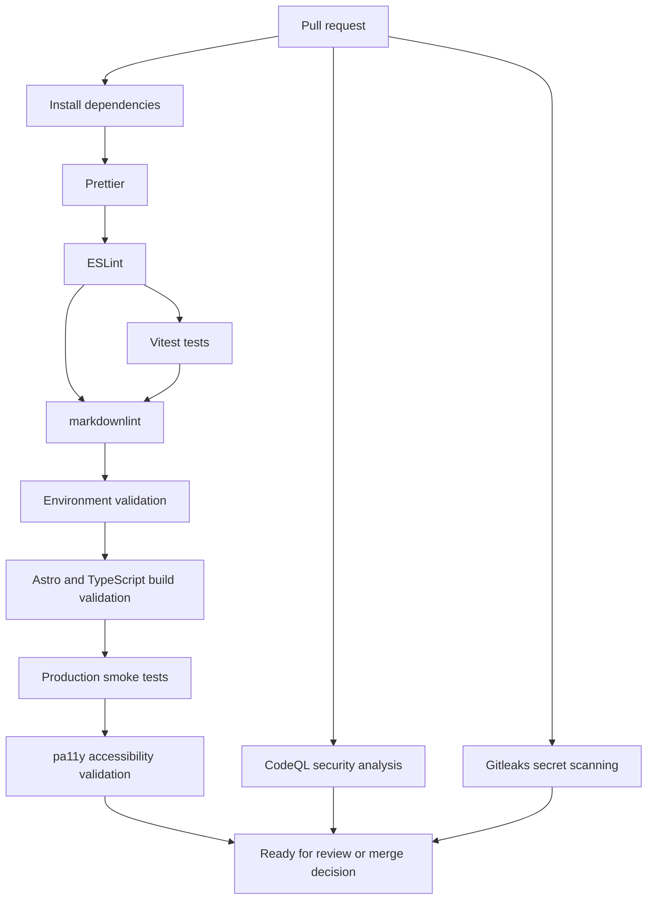

# Governance

This repository uses governance-first engineering: small reviewed changes, explicit validation, minimal operational metadata exposure, and documentation that stays close to implementation.

## Workflow

- Use trunk-based development with short-lived branches.
- Protect `main`.
- Require pull requests for all merges.
- Require passing validation checks before merge.
- Use conventional commits.
- Prefer documentation-first changes for architecture, deployment, security, and operational practices.
- Keep Cloudflare deployment changes separate from documentation-only governance changes unless a small repo hygiene update is clearly necessary.
- Keep local `.env` usage separate from deployed configuration; Cloudflare Pages project variables are the source of truth for production and preview behavior.
- Keep Terraform/IaC work validation-first until [Terraform and IaC Planning](iac.md) progresses beyond validation-only scope.

## Review Standards

Every PR should answer:

- What changed?
- How was it validated?
- Does it unnecessarily expose operational metadata such as private ownership, account, deployment, or contact details?
- Does it preserve environment-variable-driven rendering?
- Does it remain lightweight and maintainable?

Meaningful architecture, operations, deployment, Terraform authority, or
localization decisions should be captured in an [Architecture Decision Record](adr/README.md). Accepted ADRs are part of the governance baseline and should be superseded with a new ADR when a material decision changes.

## Operational Philosophy

Operational changes should favor fail-fast validation, domain-level deployment isolation, operational clarity over abstraction, and reversible steps. The platform should minimize unnecessary exposure of operational metadata while keeping deployment behavior easy to inspect and explain.

Architectural decisions should preserve the current static-first, low-maintenance model unless a concrete operational requirement justifies additional runtime complexity. Avoid adding databases, authentication, SSR, edge functions, analytics, or automation simply because they are available.

The current architecture decision baseline is documented in [Architecture Decision Records](adr/README.md), including validation-before-automation and the non-authoritative Terraform strategy.

Public metadata artifacts such as `/platform.json` are allowed only when they remain safe for static hosting. They may describe platform posture, supported locales, deployment model, and non-authoritative Terraform status, but they must not expose secrets, Cloudflare account IDs, zone IDs, API tokens, registrant details, private emails, or internal-only notes.

The [Domain Inventory](domains.md) is an operational record for public-safe onboarding and review. It does not replace the Cloudflare dashboard as the operational source of truth and does not grant Terraform authority.

## Operational Status

| Category                    | Status                                                                                                                                                                                                                                                                       |
| --------------------------- | ---------------------------------------------------------------------------------------------------------------------------------------------------------------------------------------------------------------------------------------------------------------------------- |
| Currently operational       | Astro static rendering, Zod env validation, production smoke tests, pa11y accessibility checks, CodeQL, Gitleaks, deployment safety docs, local security preflight guidance, Terraform validation-only skeleton, Cloudflare Pages module contract, and import planning docs. |
| Planned but not implemented | Terraform imports, provisioning workflows, route-based localization, and optional helper automation.                                                                                                                                                                         |
| Longer-term enhancements    | Operational inventory helpers and optional domain-specific features that preserve the low-cost governance-first model.                                                                                                                                                       |

## Current Operational Snapshot

| Area              | Status                                                                                                                                   |
| ----------------- | ---------------------------------------------------------------------------------------------------------------------------------------- |
| Current maturity  | Governance-first platform foundation with validated CI/CD, deployment architecture, Cloudflare Pages testing, and Terraform scaffolding. |
| Production status | Manual Cloudflare Pages deployments are supported; Terraform remains validation-only and non-authoritative.                              |
| Risk posture      | Low-risk and non-destructive; no automated infrastructure provisioning is enabled.                                                       |
| Phase 7A status   | Lightweight static metadata, domain inventory, and onboarding documentation are in place.                                                |
| Next milestone    | Continue operational observability without weakening static-first deployment governance.                                                 |

## What Is Real vs Planned

| Category               | Status                                                                                                                                                                                  |
| ---------------------- | --------------------------------------------------------------------------------------------------------------------------------------------------------------------------------------- |
| Real today             | Astro platform, validation scripts, CI/CD workflows, Cloudflare Pages-compatible builds, Terraform validation skeleton, reusable module scaffolding, and import planning documentation. |
| Planned but not active | Terraform provisioning, real imports, remote state, automated apply workflows, route-based localization, and full domain onboarding automation.                                         |
| Source of truth        | Cloudflare remains the operational source of truth until a reviewed import or recreation plan is executed.                                                                              |

## DevSecOps Posture

The platform applies DevSecOps principles through automated validation, CI/CD quality gates, secret scanning, CodeQL analysis, accessibility checks, production smoke validation, and deployment safety controls. These controls are intentionally lightweight and repository-managed so they can mature with the platform without hiding operational behavior.

## CI/CD Pipeline

The repository's validation commands are part of the operational governance model. They make formatting, build behavior, environment validation, production-output smoke checks, and accessibility checks repeatable locally and in GitHub Actions.

The repository includes GitHub Actions workflows for validation and CodeQL analysis. Branch protection should require passing checks before merge when configured in GitHub, but branch protection settings are managed outside the repository.



## Current CI/CD Gates

These gates map to current repository scripts and workflows:

| Gate                                  | Command or Source                                              |
| ------------------------------------- | -------------------------------------------------------------- |
| Formatting validation                 | `pnpm format:check`                                            |
| ESLint validation                     | `pnpm lint`                                                    |
| markdownlint validation               | `pnpm check:markdown`                                          |
| Environment validation                | `pnpm check:env`, backed by `scripts/check-env-validation.ts`  |
| Focused TypeScript tests              | `pnpm test`, backed by Vitest                                  |
| Astro and TypeScript build validation | `pnpm build`, invoked by `pnpm smoke`                          |
| Production smoke validation           | `pnpm smoke`, backed by `scripts/smoke-production.mjs`         |
| Accessibility validation              | `pnpm check:a11y`, backed by `scripts/check-accessibility.mjs` |
| Integrated local/CI validation        | `pnpm validate`                                                |
| Terraform validation only             | `.github/workflows/terraform-validate.yml`                     |
| CodeQL security analysis              | `.github/workflows/codeql.yml`                                 |
| Secret scanning                       | `.github/workflows/gitleaks.yml`                               |

CodeQL runs on pull requests, pushes to `main`, and a weekly schedule.
Gitleaks runs on pull requests and pushes to `main` to detect accidentally committed secrets.
The validation workflow also prints a non-gating `pnpm test:coverage` summary for visibility; no percentage threshold is enforced.

Local contributors should use the same primary confidence command documented in the [README](../README.md#current-validation-commands):

```sh
pnpm validate
```

## Accessibility Philosophy

Accessibility is a first-class engineering concern for the platform. Placeholder pages are intentionally simple, but they still represent public-facing infrastructure and should be usable by default.

- Use semantic HTML and clear landmark structure from the beginning.
- Keep the layout responsive and mobile-first so content remains readable across viewport sizes.
- Run automated pa11y validation against built production output.
- Preserve heading order and visible text clarity as content evolves.
- Treat multilingual rendering as an accessibility concern, including correct `lang` attributes and copy that does not assume one language length or layout pattern.
- Pair automated checks with manual review before public launch because tooling cannot fully evaluate assistive technology behavior, translation quality, or contextual clarity.

## Definition of Done

A change is done when:

| Requirement                          | Expected Evidence                                                                           |
| ------------------------------------ | ------------------------------------------------------------------------------------------- |
| Local validation passes              | `pnpm validate` completes successfully.                                                     |
| Focused tests pass                   | `pnpm test` passes for TypeScript config and localization helpers.                          |
| CI checks pass                       | Required GitHub Actions checks are green before merge.                                      |
| Documentation is updated             | README or relevant `docs/` files reflect changed behavior or operations.                    |
| Deployment implications are reviewed | Any Cloudflare, DNS, indexing, or environment-variable effects are understood before merge. |
| Environment config is validated      | Zod validation and smoke checks cover required public configuration.                        |
| Accessibility checks pass            | pa11y runs successfully, with manual review planned for production-facing changes.          |

Deployment-specific readiness is tracked in [Deployment](deployment.md#production-deployment-checklist).

## Lessons Learned So Far

- Governance is easier to maintain when introduced before deployment complexity grows.
- Environment validation failures are cheaper to fix locally than during Cloudflare deployment.
- Domain-level deployment isolation reduces operational risk.
- Repository-managed CodeQL and Gitleaks workflows reduce configuration drift.
- Automated accessibility checks are easier to maintain when added early.
- Strict validation pipelines improve documentation quality and release confidence.

## Local Environment Loading

Fail-fast environment validation is intentional. `pnpm build` should fail when required `PUBLIC_` variables are missing from the process environment.

For local builds, contributors may use:

```sh
pnpm build:local
```

This loads `.env` through `dotenv-cli` before running the normal build. The script is a developer-experience wrapper only; it does not change the production build contract.

## Deployment Governance

Cloudflare deployment work should preserve the multi-project model documented in [Deployment](deployment.md):

- one shared repository
- one Cloudflare Pages project per pilot domain
- strict `placeholder-platform-[domain-name]` project naming
- project-specific `PUBLIC_` variables
- no production domain values hardcoded into application source
- rollback or disablement scoped to the affected domain whenever possible

Operational readiness for each domain is tracked through [Deployment](deployment.md#operational-readiness-checklist) and the [Cloudflare Inventory Template](cloudflare-inventory.md). Inventory updates should stay factual, non-sensitive, and tied to manual validation dates.

High-risk change areas require extra review:

- deployment workflows and GitHub Actions
- environment validation logic
- canonical URL handling
- robots and sitemap generation
- Cloudflare environment documentation
- secret scanning configuration
- future Terraform or infrastructure-as-code files

Terraform/IaC planning is documented in [Terraform and IaC Planning](iac.md). The current Terraform workflow is validation-only. This repository should not include Cloudflare provider credentials, Terraform backend configuration, imports, production environments, or production apply automation until a later reviewed phase.

Reusable Terraform modules should preserve simple interface contracts, validate naming conventions, and align environment variable inputs with the existing `PUBLIC_` rendering model. Module reuse should reduce cross-domain drift without hiding operational details.

Future Terraform import work must be inventory-first and non-destructive. Existing Cloudflare Pages projects should be mapped to keyed module addresses, reviewed against the Cloudflare dashboard, and reconciled through plan-only drift review before any apply workflow is considered.

Terraform authority stages are defined in [Terraform and IaC Planning](iac.md#terraform-authority-stages). The repository remains between Stage 0 and Stage 1: validation-only Terraform exists, and import planning is documented, but Terraform does not manage live resources.

Production change checklist:

- [ ] Correct Cloudflare Pages project selected.
- [ ] Correct custom domain mapped.
- [ ] Deployment-specific `PUBLIC_` variables reviewed.
- [ ] Smoke and accessibility validation pass.
- [ ] No secrets or unnecessary operational metadata exposed.
- [ ] Rollback or forward-fix path is understood.

## Operational Conventions

| Area              | Convention                                                                                         |
| ----------------- | -------------------------------------------------------------------------------------------------- |
| Branches          | Use short-lived topic branches with conventional commit intent.                                    |
| Pages projects    | Use `placeholder-platform-[domain-name]`.                                                          |
| Validation        | Run `pnpm validate` before PR and before deployment-sensitive changes.                             |
| Deployment review | Confirm project, domain, environment variables, canonical URL, robots, sitemap, and rollback path. |
| Inventory updates | Update non-sensitive Cloudflare inventory after onboarding, validation, or drift observations.     |
| Terraform changes | Keep validation-only unless a later reviewed phase explicitly introduces authority.                |

New-domain onboarding should use [Domain Onboarding](domain-onboarding.md), preserve validation-first discipline, and update [Domain Inventory](domains.md) with only public-safe operational facts.

## Phase 7A Operational Observability

The governance baseline now includes lightweight operational observability through static metadata and public-safe domain records. This should improve reviewability without changing production deployment behavior.

Phase 7A adds:

- a static `/platform.json` metadata artifact
- a [Domain Inventory](domains.md) for public-safe operational records
- a [Domain Onboarding](domain-onboarding.md) checklist for repeatable new-domain setup

The metadata artifact should stay safe for static public hosting. The inventory should remain a factual operational record, not Terraform state. Onboarding should preserve Cloudflare Pages Git integration, `PUBLIC_` configuration, validation-first review, and non-authoritative Terraform posture.

Completed Phase 6 localization work remains governed by the current localization model: English, Simplified Chinese, and Thai are supported without route-based i18n, and coverage remains non-gating by percentage.

## Coverage Governance

Current posture:

- `pnpm test` runs Vitest and is part of `pnpm validate`.
- `pnpm test:coverage` generates a local and CI-visible coverage report.
- Coverage focuses on source TypeScript runtime logic under `src/**/*.ts`.
- Coverage excludes tests, type declarations, generated output, docs, scripts, Terraform files, dependencies, and local coverage artifacts.
- Astro rendering behavior and framework route wrappers are validated through build, smoke, and accessibility checks rather than fragile unit tests.
- No hard coverage percentage threshold is enforced.

Coverage remains non-gating by percentage because the project has limited runtime logic and should prioritize meaningful tests over vanity metrics. Revisit a modest threshold when localization selection, reusable utilities, or runtime behavior grow enough for a threshold to help review quality instead of creating noise.

## Secret Scanning Governance

Gitleaks is used as a CI secret scanning layer. It complements GitHub secret scanning and code review; it does not make committing secrets safe.

Secrets and sensitive operational values belong in GitHub Secrets, Cloudflare Pages project variables, or future reviewed IaC-safe secret workflows. Do not commit `.env` files, API tokens, Cloudflare credentials, account IDs, private ownership details, or private operational contact information.

Local Gitleaks usage is optional. Developers who already have Gitleaks installed can run:

```sh
gitleaks git --redact --verbose
```

Use extra care when changing:

- GitHub Actions workflows
- environment examples and local env handling
- Cloudflare deployment documentation
- future Terraform or infrastructure-as-code files

Code coverage gates are intentionally deferred. They can be considered later if meaningful application logic, reusable utilities, or IaC automation scripts are introduced.

## Local Security Preflight

Before opening a PR, run:

```sh
pnpm validate
git diff --check
```

If Gitleaks is installed locally, optionally run:

```sh
gitleaks git --redact --verbose
```

Use this concise PR-readiness checklist:

- [ ] `pnpm validate` passes locally.
- [ ] `git diff --check` passes.
- [ ] No secrets, tokens, account IDs, or private operational details are committed.
- [ ] No `.env` files are committed.
- [ ] Docs/examples do not contain real Cloudflare tokens or account IDs.
- [ ] Workflow, environment, deployment, secret scanning, or future IaC changes received extra review.
