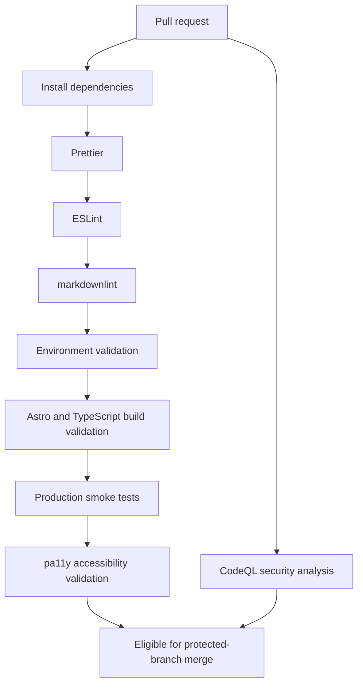

# Governance

This repository uses governance-first engineering: small reviewed changes, explicit validation, minimal operational metadata exposure, and documentation that stays close to implementation.

## Workflow

- Use trunk-based development with short-lived branches.
- Protect `main`.
- Require pull requests for all merges.
- Require passing validation checks before merge.
- Use conventional commits.
- Prefer documentation-first changes for architecture, deployment, security, and operational practices.
- Keep Cloudflare deployment changes separate from documentation-only governance changes unless a small repo hygiene update is clearly necessary.

## Review Standards

Every PR should answer:

- What changed?
- How was it validated?
- Does it unnecessarily expose operational metadata such as private ownership, account, deployment, or contact details?
- Does it preserve environment-variable-driven rendering?
- Does it remain lightweight and maintainable?

## CI/CD Pipeline

The validation workflow is the required pre-merge quality gate. It should run for pull requests and pushes to `main`, and branch protection should require the checks to pass before merge.



The validation workflow runs:

- Prettier check
- ESLint
- markdownlint
- Zod environment validation checks
- Astro type checking
- Production build
- Production smoke tests
- pa11y accessibility validation against generated output

CodeQL runs on pull requests, pushes to `main`, and a weekly schedule.

Local contributors should use the same primary confidence command documented in the [README](../README.md#validation):

```sh
pnpm validate
```

## Accessibility Philosophy

Accessibility is a first-class engineering concern for the platform. Placeholder pages are intentionally simple, but they still represent public-facing infrastructure and should be usable by default.

- Use semantic HTML and clear landmark structure from the beginning.
- Keep the layout responsive and mobile-first so content remains readable across viewport sizes.
- Run automated pa11y validation against built production output.
- Preserve heading order and visible text clarity as content evolves.
- Treat multilingual rendering as an accessibility concern, including correct `lang` attributes and copy that does not assume one language length or layout pattern.
- Pair automated checks with manual review before public launch because tooling cannot fully evaluate assistive technology behavior, translation quality, or contextual clarity.

## Definition of Done

A change is done when:

| Requirement                          | Expected Evidence                                                                           |
| ------------------------------------ | ------------------------------------------------------------------------------------------- |
| Local validation passes              | `pnpm validate` completes successfully.                                                     |
| CI checks pass                       | Required GitHub Actions checks are green before merge.                                      |
| Documentation is updated             | README or relevant `docs/` files reflect changed behavior or operations.                    |
| Deployment implications are reviewed | Any Cloudflare, DNS, indexing, or environment-variable effects are understood before merge. |
| Environment config is validated      | Zod validation and smoke checks cover required public configuration.                        |
| Accessibility checks pass            | pa11y runs successfully, with manual review planned for production-facing changes.          |

Deployment-specific readiness is tracked in [Deployment](deployment.md#production-deployment-checklist).

## Deployment Governance

Cloudflare deployment work should preserve the multi-project model documented in [Deployment](deployment.md):

- one shared repository
- one Cloudflare Pages project per pilot domain
- strict `placeholder-[domain-name]` project naming
- project-specific `PUBLIC_` variables
- no production domain values hardcoded into application source
- rollback or disablement scoped to the affected domain whenever possible
